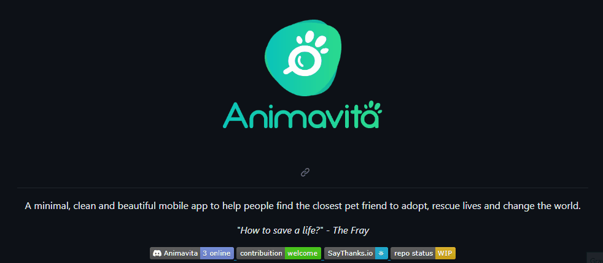

# Projeto com README
Um projeto de teste com arquivo README 🐱‍🏍✔

[](https://github.com/animavita)

## Tecnologias utilizadas:
- HTML
- CSS
- JS

## Como utilizar

1 - Clone o projeto
```
git clone <url>
```
2 - Acesse a pasta do projeto

```
cd reposiorio-com-readme
```